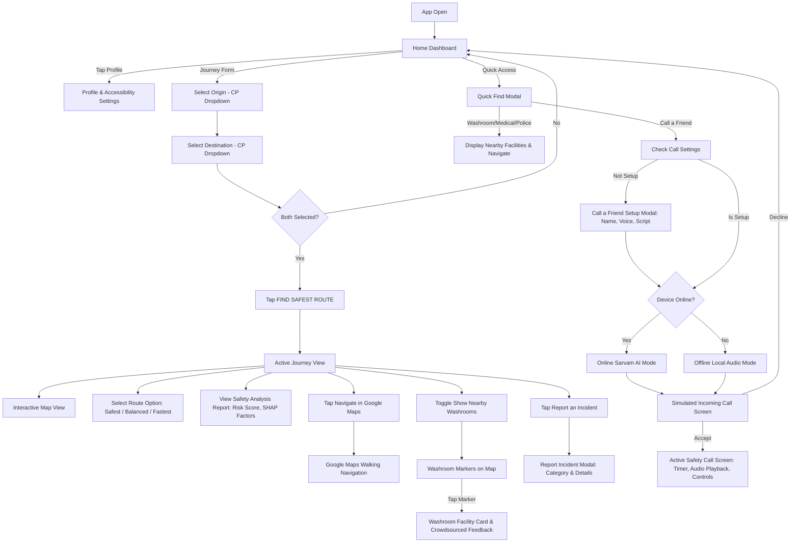
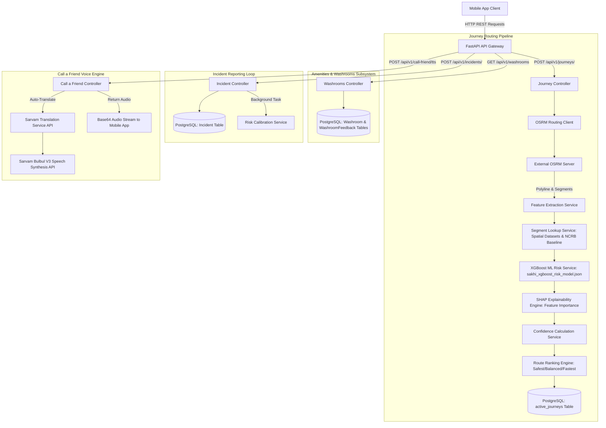

# SAKHI Architecture & Flowchart Audit Report

**Document Version:** 1.0.0  
**Date:** August 26, 2026  
**Target Project:** SAKHI (Smart Assistance for keeping HER informed) — Delhi Pilot  
**Author:** Antigravity AI Architecture Audit Engine  

---

## Executive Summary

This report delivers a 100% repository-grounded technical architecture audit of the **SAKHI** codebase (`c:\GitHub\SAKHI`). The objective is to define the exact node specifications, data flows, boundaries, and Mermaid structures required to produce **EXACTLY TWO** definitive, high-resolution architectural flowchart diagrams:

1. **FRONTEND FLOWCHART — COMPLETE USER FLOW** (*"What does a user actually do in the application?"*)
2. **BACKEND FLOWCHART — COMPLETE TECHNICAL / SYSTEM ARCHITECTURE** (*"What happens technically behind the application?"*)

### CRITICAL SCOPE ENFORCEMENT
Per product specification, **ALL EMERGENCY FEATURES** have been completely removed from the product vision and MUST NOT appear in either flowchart:
- ❌ Emergency SOS / SOS Buttons
- ❌ 112 Dispatch / Emergency Services Contact
- ❌ Dead-Man Switch / Periodic Check-ins
- ❌ Shake-to-SOS / Hardware Triggers
- ❌ Emergency Contacts / Location Broadcasts
- ❌ SMS Emergency Fallback
- ❌ BLE Emergency Fallback

---

## 1. Repository Audit Summary

The SAKHI repository was audited across all major modules:
- **`backend/`**: FastAPI REST API framework, PostgreSQL/PostGIS spatial database interfaces, OSRM routing client, XGBoost ML risk inference service, SHAP explainability engine, Sarvam AI TTS & translation integrations, crowdsourced washroom feedback, and incident reporting endpoints.
- **`mobile/`**: React Native (Expo SDK 52) mobile application featuring multi-tab navigation (`Home`, `Journeys`, `Amenities`, `Profile`), MapTiler/Mapbox route map rendering, Google Maps walking navigation intent, two-layer Call a Friend (Online Sarvam AI / Offline bundled audio), Quick Find amenities, incident reporting modal, and offline caching layer (`AsyncStorage`).
- **`ml/`**: Preprocessing scripts, synthetic proxy generators (lighting, CCTV, footfall, crime hotspots), XGBoost model training (`sakhi_xgboost_risk_model.json`), SHAP tree explainer module (`explain_risk.py`), and confidence estimator (`build_confidence.py`).
- **`data/` (in `ml/data/`)**: Verified Delhi spatial datasets (`police_stations.csv`, `hospitals.csv`, `medical_facilities.csv`, `public_amenities.csv`), NCRB district historical crime baseline (`district_historical_baseline.csv`), and reference road segments (`segment_context_features.csv`).

---

## 2. Frontend / User Flow Audit

### 2.1 Complete Screen & User Journey Sequence

```
[App Open]
    │
    ▼
[Home Dashboard] ────► [Profile Modal] (Accessibility Mode Toggle & Identity Status)
    │
    ├─────────────► [Journey Input Form]
    │                   │
    │                   ├─► Select Origin (Connaught Place Pilot dropdown)
    │                   ├─► Select Destination (Connaught Place Pilot dropdown)
    │                   └─► Swap Origin/Destination
    │                           │
    │                           ▼
    │                   [Tap "FIND SAFEST ROUTE"]
    │                           │
    │                           ▼
    ├─────────────► [Active Journey View (Journeys Tab)]
    │                   │
    │                   ├─► [Interactive Map View] (Route geometry polyline, origin/destination pins)
    │                   │
    │                   ├─► [Route Options Selector]
    │                   │     ├─► Safest Route (Lowest risk score)
    │                   │     ├─► Balanced Route (Tradeoff risk vs duration)
    │                   │     └─► Fastest Route (Shortest walking time)
    │                   │
    │                   ├─► [View Safety Analysis Report]
    │                   │     ├─► Risk Score (0-100) & Risk Level (Low/Moderate/High)
    │                   │     ├─► Confidence Score (%) & Uncertainty Penalty
    │                   │     └─► SHAP Explanations (Feature contributions e.g. lighting, police proximity)
    │                   │
    │                   ├─► [Open Google Maps Navigation] (Launches native turn-by-turn walking intent with waypoints)
    │                   │
    │                   ├─► [Toggle Nearby Washrooms]
    │                   │     └─► Renders verified public washroom markers on map
    │                   │           └─► Tap Washroom Marker ──► [Washroom Facility Card]
    │                   │                                         ├─► View cleanliness/safety ratings
    │                   │                                         └─► Submit Crowdsourced Feedback
    │                   │
    │                   └─► [Report Safety Incident]
    │                         └─► Opens [Report Incident Modal]
    │                               ├─► Select Category (Suspicious Activity / Streetlight Out)
    │                               ├─► Enter Optional Description
    │                               └─► Submit Report ──► Linked to active segment ID
    │
    ├─────────────► [Quick Find Modal]
    │                   ├─► Find Washroom (Quick search + Navigate button)
    │                   ├─► Find Medical Clinic (Quick search + Navigate button)
    │                   ├─► Find Police Station (Quick search + Navigate button)
    │                   └─► Call a Friend (Safety call trigger)
    │                           │
    │                           ▼
    └─────────────► [Call a Friend Flow]
                        │
                        ├─► Check Configuration Status
                        │     └─► If NOT setup ──► [Call a Friend Setup Modal]
                        │                             ├─► Caller Name (Bro, Mom, Love, Custom)
                        │                             ├─► Script Input Language (EN, HI, MR)
                        │                             ├─► Spoken Voice Language (EN, HI, MR)
                        │                             ├─► Voice Gender (Female/Male)
                        │                             ├─► Call Script Text (up to 2500 chars)
                        │                             └─► Duration (2, 5, 10 mins)
                        │
                        ├─► [Select Execution Mode]
                        │     ├─► Online Sarvam AI (Requires Internet -> Generates live TTS with translation)
                        │     └─► Offline Bundled (No Internet required -> Uses pre-recorded WAV assets)
                        │
                        ├─► [Simulated Incoming Call Screen]
                        │     ├─► Simulated phone ringtone playback
                        │     ├─► Caller Name & Avatar display
                        │     ├─► Decline Button ──► Ends call & resets modal
                        │     └─► Accept Button ──► Establishes Call
                        │
                        └─► [Active Safety Call Screen]
                              ├─► Real-time Call Duration Timer
                              ├─► Audio Playback (Sarvam AI Speech or Bundled Offline WAV)
                              ├─► Mute / Unmute Toggle
                              ├─► Speaker / Earpiece Toggle
                              └─► End Call Button ──► Ends call & resets modal
```

### 2.2 Detailed Sub-System Audits

#### A. Location Selection Method
- **Implementation Status:** `IMPLEMENTED` (Pilot Constrained).
- **Supported Methods:** Curated selection from Connaught Place Pilot locations (`Rajiv Chowk Metro Station`, `Connaught Place Inner Circle`, `Janpath Market`, `Palika Bazaar`, `Parliament Street`, `Barakhamba Road`, `Mandi House Metro`).
- **GPS Usage:** Foreground location permission requested on app start for distance calculations and nearby washroom spatial queries. If GPS permission denied or emulator location unavailable, falls back to Rajiv Chowk coordinates (`28.6328, 77.2197`).
- **Manual Search:** Free-form text geocoding is NOT implemented in current pilot (selection strictly enforced from verified list).

#### B. Amenities & "Right to Pee"
- **Implementation Status:** `IMPLEMENTED`.
- **Retrieval Flow:** User toggles "Show nearby washroom" switch on Active Journey map or opens Amenities tab/Quick Find.
- **Backend API:** `GET /api/v1/washrooms?lat={lat}&lon={lon}&radius_m=2000`.
- **Data Source:** Verified spatial database (`Washroom` model in DB) with crowdsourced consensus ratings (`WashroomFeedback` model).
- **Navigation:** Clicking "Navigate Now" on a facility card formats Google Maps walking directions intent (`https://www.google.com/maps/dir/?api=1&origin={user_lat,user_lon}&destination={facility_lat,facility_lon}`).

#### C. Incident Reporting
- **Implementation Status:** `IMPLEMENTED`.
- **UI Modal:** `ReportIncidentModal.tsx`.
- **Categories:** `Suspicious Activity` (Severity score: 60) and `Streetlight Out` (Severity score: 40).
- **Payload:** Links report to `segment_id`, user identity (`current_user.id`), latitude, longitude, and optional text description.
- **Backend Service:** `POST /api/v1/incidents/`. Saves incident to PostgreSQL database and triggers background task (`recalculate_segment_risk`) to recalibrate segment risk scores dynamically.

#### D. Call a Friend
- **Implementation Status:** `IMPLEMENTED` (Two-Layer Online/Offline System).
- **Online Layer:** Uses Sarvam AI Bulbul V3 TTS API (`POST /api/v1/call-friend/tts`). Supports cross-language translation (e.g., input script in English translated to spoken Hindi/Marathi before speech synthesis) and speaker selection (`priya` for female, `shubh` for male).
- **Offline Layer:** Uses locally bundled high-quality WAV audio assets (`offlineAudioRegistry.ts`: `en_female.wav`, `hi_female.wav`, `mr_female.wav`, etc.). Triggered automatically when device is offline (`useNetworkStatus.ts`) or manually selected by user.
- **Simulated Call UI:** Incoming ringing screen with synthesized dual-tone ringtone, caller name display, accept/decline buttons, call duration timer, speaker/mute toggles, and full audio playback controls.

---

## 3. Backend / Technical Architecture Audit

### 3.1 Data Flow Sequence

```
[Mobile App]
    │
    ▼  (HTTP POST /api/v1/journeys/)
[FastAPI Router (journeys.py)]
    │
    ▼
[OSRMRoutingService] ──► [External OSRM Server] ──► Returns Raw Route Polyline & Segments
    │
    ▼
[FeatureService] ──► Queries [SegmentLookupService]
    │                      ├─► Real Spatial Data (Police, Hospitals, Amenities CSV/DB)
    │                      ├─► District Baseline Data (NCRB Crime Statistics)
    │                      └─► Synthetic Proxies (Lighting, CCTV, Footfall, Hotspots)
    │
    ▼
[MLModelService] ──► Runs Inference on [XGBoost Model (sakhi_xgboost_risk_model.json)]
    │                      └─► Generates Segment Risk Score (0-100)
    │
    ▼
[SHAPService] ──► Computes Feature Attribution via TreeExplainer
    │                      └─► Generates Explanations (Top risk & safety factors)
    │
    ▼
[ConfidenceService] ──► Computes Data Density & Uncertainty Penalty
    │                      └─► Generates Confidence Score (%)
    │
    ▼
[RouteRankingService] ──► Aggregates Segment Risk Scores across Routes
    │                         └─► Ranks Routes: Safest, Balanced, Fastest
    │
    ▼
[Database Persistence] ──► Writes Active Journey to PostgreSQL (`active_journeys` table)
    │
    ▼  (JSON Response)
[Mobile App] ──► Caches Journey locally via `AsyncStorage` (Offline Resilience)
```

### 3.2 Backend Service Components

| Component | File Path | Role | Inputs | Outputs |
| :--- | :--- | :--- | :--- | :--- |
| **API Router** | `backend/app/api/v1/api.py` | Central FastAPI endpoint router | HTTP Requests | JSON Responses |
| **Routing Endpoint** | `backend/app/api/v1/endpoints/journeys.py` | Journey creation & context update handler | `JourneyRequest` (Origin, Dest) | `JourneyResponse` |
| **OSRM Client** | `backend/app/services/routing/osrm_client.py` | Fetches walking routes & geometry | Coordinates (Lat/Lon) | Polyline & Waypoints |
| **Feature Service** | `backend/app/services/risk/feature_service.py` | Extracts spatial & contextual features per segment | Segment coordinates, Time | Feature Vector (24 features) |
| **Segment Lookup** | `backend/app/services/risk/segment_lookup_service.py` | Caches & queries spatial reference datasets | Lat/Lon | Infrastructure Distances & Proxies |
| **ML Model Service** | `backend/app/services/risk/ml_model_service.py` | Evaluates segment safety risk using XGBoost | Feature Vector | Segment Risk Score (0-100) |
| **SHAP Service** | `backend/app/services/risk/shap_service.py` | Generates feature importance explanations | Feature Vector, Model | SHAP values & Top Factors |
| **Confidence Service**| `backend/app/services/risk/confidence_service.py` | Calculates data sample density & uncertainty | Segment ID, Features | Confidence Score & Penalty |
| **Route Ranking** | `backend/app/services/routing/route_ranking_service.py` | Ranks candidate routes by safety cost function | Segment Risk Scores | Safest, Balanced, Fastest Routes |
| **Incidents Endpoint**| `backend/app/api/v1/endpoints/incidents.py` | Stores incident & triggers recalibration | `IncidentCreate` payload | `IncidentResponse` |
| **Calibration Service**| `backend/app/services/risk/calibration_service.py` | Background task to update segment risk score | DB session, Segment ID | Updated Segment Risk |
| **Washrooms Endpoint**| `backend/app/api/v1/endpoints/washrooms.py` | Queries nearby washrooms & handles feedback | Lat/Lon, Radius | `WashroomListResponse` |
| **Call Friend Endpoint**| `backend/app/api/v1/endpoints/call_friend.py` | Manages settings & Sarvam AI TTS generation | `TTSRequest` | `TTSResponse` (Base64 WAV) |
| **Sarvam Translation**| `backend/app/services/sarvam_translation.py` | Translates call script between languages | Text, Source/Target Lang | Translated Text |
| **Sarvam TTS Service**| `backend/app/services/sarvam_tts.py` | Calls Sarvam Bulbul V3 REST API for speech synthesis | Text, Speaker, Lang | Base64 Audio Stream |

---

## 4. Component Status Classification

| Component | Status | Details |
| :--- | :--- | :--- |
| **Journey Form & Routing** | `IMPLEMENTED` | Connaught Place pilot route calculation via OSRM + XGBoost |
| **XGBoost Risk Pipeline** | `IMPLEMENTED` | Model loaded from `sakhi_xgboost_risk_model.json` with 24 spatial features |
| **SHAP Explainability** | `IMPLEMENTED` | Local tree explainer provides top safety and risk factors |
| **Confidence Scoring** | `IMPLEMENTED` | Density-based confidence computation with uncertainty penalty |
| **Google Maps Navigation** | `IMPLEMENTED` | Open URL intent with walking mode and polyline waypoints |
| **Washroom & Right to Pee**| `IMPLEMENTED` | DB query, Haversine distance, feedback aggregation, navigation |
| **Incident Reporting** | `IMPLEMENTED` | Report modal, DB persistence, background risk recalibration task |
| **Call a Friend (Online)** | `IMPLEMENTED` | Sarvam Bulbul V3 TTS, auto-translation (EN/HI/MR), voice selection |
| **Call a Friend (Offline)** | `IMPLEMENTED` | Bundled local WAV audio assets fallback via `expo-audio` |
| **Call a Friend Setup** | `IMPLEMENTED` | User settings persistence in DB & custom script builder |
| **Accessibility Toggle** | `IMPLEMENTED` | Accessibility context state toggle in Profile screen |
| **Quick Find Amenities** | `DEMO / MOCK` | Hardcoded demo responses for medical & police quick search |
| **General Free-form Search**| `NOT IMPLEMENTED`| Address geocoding limited to CP pilot dropdown locations |
| **Emergency SOS / 112** | **REMOVED** | Explicitly removed from scope and documentation |

---

## 5. Architectural Inconsistencies & Outdated Code Notes

1. **Legacy Emergency Endpoints in Codebase:**  
   The backend retains a legacy router file (`backend/app/api/v1/endpoints/emergency.py`) and schema (`CheckinRequest`), and the frontend dashboard retains a legacy SOS button (`handleSOSTap`). *These legacy components are marked for deprecation and MUST NOT appear in any architecture flowcharts.*
2. **Quick Find Amenities Mock Data:**  
   While the `/api/v1/washrooms` endpoint queries live DB data, the `QuickFindModal` contains mock fallback text for Medical and Police search ("City Emergency Care", "Safe Shelter Point").
3. **Location Selection Constraint:**  
   The UI presents a dropdown of Connaught Place pilot locations rather than a full Google Places geocoding search bar.

---

## 6. Deprecated / Removed Features List

The following features **MUST NOT APPEAR** in any shape or form in either flowchart:
- 🚫 Emergency SOS Button / Panel
- 🚫 112 Emergency Services Dispatch
- 🚫 Dead-Man Switch Check-in Loop
- 🚫 Shake-to-SOS Detection
- 🚫 Emergency Contact Notification / SMS Alert
- 🚫 BLE / Mesh Network Emergency Fallback

---

## 7. Exact Frontend Flowchart Specification

### Node List & Transition Logic

```
F01 [Start: User Opens SAKHI Mobile App]
 │
 ▼
F02 [Home Dashboard Screen]
 │
 ├──► [Tap Profile Icon] ──► F03 [Profile & Accessibility Modal] ──► (Toggle Accessibility Mode / View App Info)
 │
 ├──► [Journey Input Form]
 │      │
 │      ▼
 │    F04 [Select Origin Location] (Connaught Place Pilot Dropdown)
 │      │
 │      ▼
 │    F05 [Select Destination Location] (Connaught Place Pilot Dropdown)
 │      │
 │      ▼
 │    F06 [Decision: Both Locations Selected?]
 │      ├── No  ──► Display Validation Error
 │      └── Yes ──► F07 [Tap "FIND SAFEST ROUTE"]
 │                    │
 │                    ▼
 │                  F08 [Active Journey View (Journeys Tab)]
 │                    │
 │                    ├─► F09 [Interactive Route Map] (Polyline rendering & segment selection)
 │                    │
 │                    ├─► F10 [Select Route Option]
 │                    │     ├─► Safest Route (Lowest risk score)
 │                    │     ├─► Balanced Route (Optimal risk vs time)
 │                    │     └─► Fastest Route (Shortest duration)
 │                    │
 │                    ├─► F11 [View Safety Analysis Report]
 │                    │     └─► Displays Risk Score, Confidence %, & SHAP Explanations
 │                    │
 │                    ├─► F12 [Tap "Navigate in Google Maps"]
 │                    │     └─► F13 [External Launch: Google Maps Walking Navigation]
 │                    │
 │                    ├─► F14 [Toggle "Show Nearby Washrooms"]
 │                    │     └─► F15 [View Washroom Markers on Map]
 │                    │           └─► Tap Marker ──► F16 [Washroom Facility Card]
 │                    │                                └─► Submit Crowdsourced Rating / Feedback
 │                    │
 │                    └─► F17 [Tap "Report an Incident"]
 │                          └─► F18 [Report Incident Modal]
 │                                ├─► Select Category (Suspicious Activity / Streetlight Out)
 │                                ├─► Enter Optional Description
 │                                └─► Tap "Submit Report" ──► Linked to active segment ID
 │
 └──► [Tap "Quick Access" / "Call a Friend"]
        │
        ▼
      F19 [Quick Find Modal]
        │
        ├─► Select Washroom / Medical / Police ──► F20 [Display Nearby Facility Results] ──► Tap "Navigate Now"
        │
        └─► Select "Call a Friend"
              │
              ▼
            F21 [Check User Call Settings]
              │
              ├── Settings Missing? ──► F22 [Call a Friend Setup Modal]
              │                          ├─► Set Caller Name, Languages (EN/HI/MR), Voice Gender, Script, Duration
              │                          └─► Save Configuration Settings
              │
              └── Settings Present ──► F23 [Decision: Device Online or Offline?]
                                         │
                                         ├─► Online  ──► F24 [Select Online Sarvam AI Mode] (Live AI voice synthesis)
                                         └─► Offline ──► F25 [Select Offline Bundled Mode] (Pre-recorded local audio)
                                                │
                                                ▼
                                              F26 [Simulated Incoming Call Screen]
                                                │
                                                ├─► Tap "Decline" ──► Call Cancelled & Reset
                                                └─► Tap "Accept"  ──► F27 [Active Safety Call Screen]
                                                                        ├─► Live Call Duration Timer
                                                                        ├─► Play Audio (Sarvam AI Speech / Local WAV)
                                                                        ├─► Toggle Speaker / Mute
                                                                        └─► Tap "End Call" ──► Call Ended & Reset
```

---

## 8. Exact Backend Flowchart Specification

### Node List & Component Specification

```
B01 [Mobile App Client (React Native / Expo)]
 │
 ▼  (HTTP REST API Requests)
B02 [FastAPI API Gateway (app/api/v1/api.py)]
 │
 ├──► [POST /api/v1/journeys/] ──► B03 [Journey Controller (journeys.py)]
 │                                   │
 │                                   ▼
 │                                 B04 [OSRM Routing Client (osrm_client.py)]
 │                                   │
 │                                   ▼
 │                                 B05 [External OSRM Server] ──► Returns Walking Route Polyline & Segments
 │                                   │
 │                                   ▼
 │                                 B06 [Feature Extraction Service (feature_service.py)]
 │                                   │
 │                                   ▼
 │                                 B07 [Spatial Reference Lookup Service (segment_lookup_service.py)]
 │                                   ├── Real GIS Infrastructure Datasets (Police, Hospitals, Amenities CSVs)
 │                                   ├── NCRB Historical Crime Baseline (District level)
 │                                   └── Synthetic Proxies (Lighting, CCTV, Footfall, Hotspots)
 │                                   │
 │                                   ▼
 │                                 B08 [XGBoost ML Risk Inference Service (ml_model_service.py)]
 │                                   └─► Loads `sakhi_xgboost_risk_model.json` ──► Computes Segment Risk Score (0-100)
 │                                   │
 │                                   ▼
 │                                 B09 [SHAP Explainability Engine (shap_service.py)]
 │                                   └─► TreeExplainer Feature Importance ──► Generates Safety & Risk Factors
 │                                   │
 │                                   ▼
 │                                 B10 [Confidence Calculation Service (confidence_service.py)]
 │                                   └─► Sample Density Analysis ──► Computes Confidence % & Uncertainty Penalty
 │                                   │
 │                                   ▼
 │                                 B11 [Route Ranking Engine (route_ranking_service.py)]
 │                                   └─► Safety Cost Function ──► Ranks Routes: Safest, Balanced, Fastest
 │                                   │
 │                                   ▼
 │                                 B12 [PostgreSQL Database (active_journeys table)]
 │                                   └─► Persists Active Journey Record
 │
 ├──► [GET /api/v1/washrooms] ────► B13 [Washrooms Controller (washrooms.py)]
 │                                   │
 │                                   ▼
 │                                 B14 [PostgreSQL Database (Washroom & WashroomFeedback tables)]
 │                                   └─► Haversine Distance Filter & Consensus Aggregation (Open, Cleanliness, Safety)
 │
 ├──► [POST /api/v1/incidents/] ──► B15 [Incident Report Controller (incidents.py)]
 │                                   │
 │                                   ├─► B16 [PostgreSQL Database (Incident table)] ──► Saves Incident Record
 │                                   │
 │                                   └─► B17 [FastAPI Background Tasks]
 │                                         │
 │                                         ▼
 │                                       B18 [Risk Calibration Service (calibration_service.py)]
 │                                         └─► Recalculates Dynamic Segment Risk Score
 │
 └──► [POST /api/v1/call-friend/tts] ──► B19 [Call a Friend Controller (call_friend.py)]
                                           │
                                           ├─► B20 [Sarvam Translation Service (sarvam_translation.py)]
                                           │     └─► Calls Sarvam Translate API (if source_lang != target_lang)
                                           │
                                           └─► B21 [Sarvam Speech Synthesis Service (sarvam_tts.py)]
                                                 └─► Calls Sarvam Bulbul V3 TTS API (Female/Male Speaker)
                                                       │
                                                       ▼
                                                     B22 [Returns Base64 WAV Audio Stream to Mobile App]
```

---

## 9. Mermaid-Ready Architecture Structure

### A. Frontend User Flow (Mermaid Syntax)



### B. Backend Technical Architecture (Mermaid Syntax)



---

## 10. Conclusion & Final Recommendation

This audit report serves as the complete, unambiguous source of truth for the SAKHI application architecture. The provided node lists, specifications, and Mermaid-ready structures can be directly passed to any visualization tool or renderer to generate the final **Frontend User Flow** and **Backend System Architecture** flowcharts without ambiguity or guesswork.
